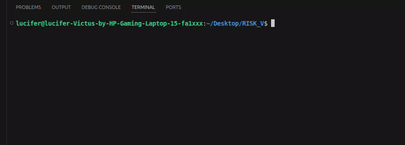
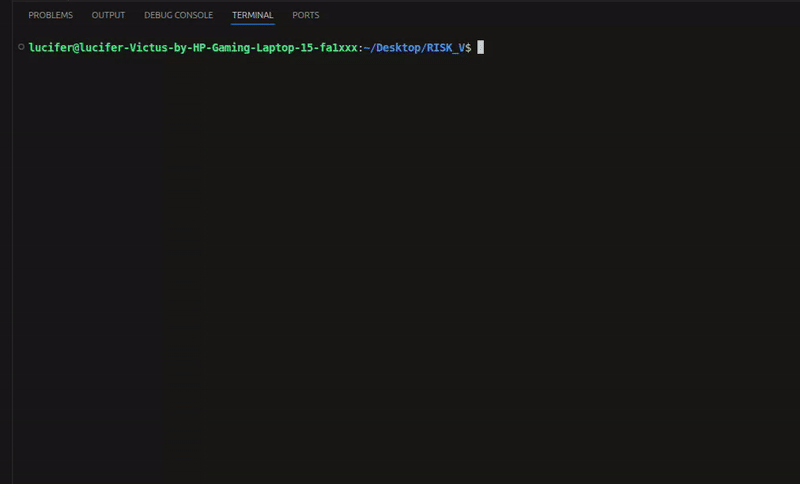

# 🚀 RISC-V Terminal Algorithm Demos

This project contains two animated Bash-based simulations designed to demonstrate **core computational paradigms**:

* **Recursion** → Tower of Hanoi
* **Iteration** → Conway’s Game of Life

The goal is to provide minimal, dependency-free visualizations that make algorithm behavior easy to understand.

## 🎯 Objective

This project demonstrates two core computational paradigms:
- Recursion (Tower of Hanoi)
- Iteration (Conway’s Game of Life)

using terminal-based visual simulations in Bash.

---

## 🧠 1. Tower of Hanoi (Recursion)

A recursive solution visualized step-by-step in the terminal.

### 🔁 Concepts Demonstrated

* Recursive decomposition of a problem
* Use of call stack to manage execution
* Sequential state transitions

### 🔍 What to Observe

* Each move is printed and visualized
* Rod states update after every recursive call
* Progress bar reflects completion (2ⁿ − 1 moves)

### ▶️ Run

```bash
./tower_of_hanoi.sh 4 0.2
```

### 🎬 Demo



### 📐 Correctness

Minimum moves required:
**2ⁿ − 1 → For n=4 → 15 moves**

---

## 🔄 2. Conway's Game of Life (Iteration)

A grid-based simulation demonstrating iterative updates and emergent behavior.

### 🔁 Concepts Demonstrated

* Iteration over a 2D grid
* Neighbor-based rule evaluation
* Continuous state updates

### 🔍 What to Observe

* Each generation recomputes the entire grid
* Cells evolve based on local interactions
* Patterns (glider, blinker, acorn) emerge and move over time

### ▶️ Run

```bash
./game_of_life.sh 20 40 0.12 0 glider 1
```

### 🎬 Demo



These demos are designed to make algorithm execution visually observable rather than abstract.
---

## ⚙️ Features

* Pure Bash implementation (no external dependencies)
* Terminal-based animations with colored output
* Configurable parameters (speed, size, patterns)
* Auto-stop conditions (Game of Life)

---

## 🎯 Relevance

These demos illustrate how fundamental algorithmic concepts can be:

* Implemented with minimal tools
* Visualized clearly in terminal environments
* Understood before transitioning to lower-level systems (e.g., RISC-V)

---

## 👨‍💻 Author

Sachin Kumar
